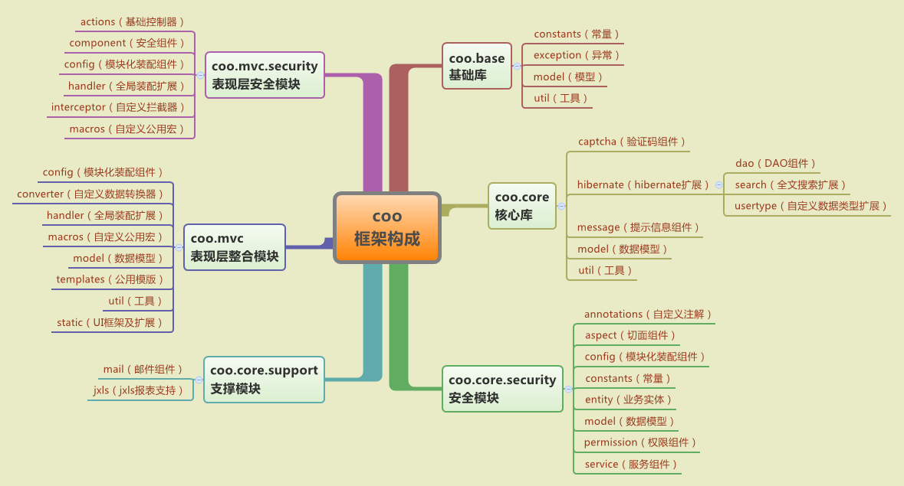

##1.2 框架构成

coo由以下子模块项目组成：
* coo.base：基础模块。基础工具类、异常定义、常量定义、基础模型等。
* coo.core：核心模块。整合封装[hibernate][]/[hibernate search][]/[spring][]的核心模块。
* coo.core.support：支撑模块。邮件、报表等通用支撑功能模块，整合封装[jxls][]。
* coo.core.security：安全模块。整合[shiro][]作为权限控制模块。
* coo.mvc：整合封装[spring mvc][]/[freemarker][]/[dwz][]/[echarts][]作为表现层基础模块。
* coo.mvc.security：基于[spring mvc][]的权限控制模块。

[hibernate]: http://hibernate.org/
[hibernate search]: http://hibernate.org/search/
[spring]: http://projects.spring.io/spring-framework/
[shiro]: http://shiro.apache.org/
[spring mvc]: http://projects.spring.io/spring-framework/
[freemarker]: http://freemarker.org/
[dwz]: https://github.com/Jnoee/dwz
[echarts]: http://echarts.baidu.com/
[jxls]: http://jxls.sourceforge.net/