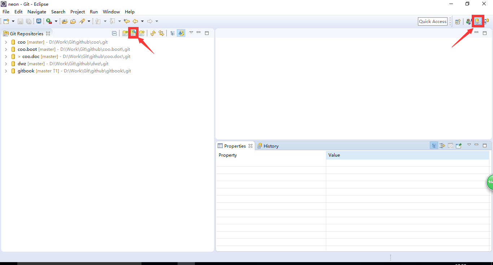
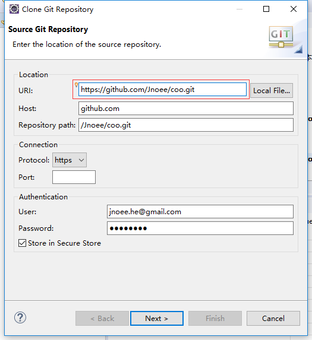
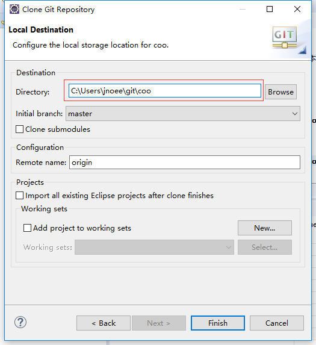
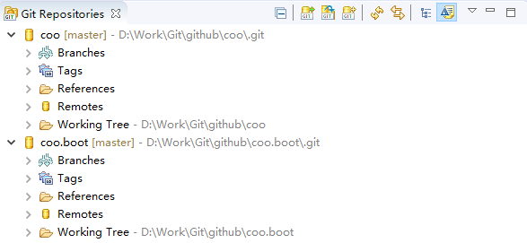
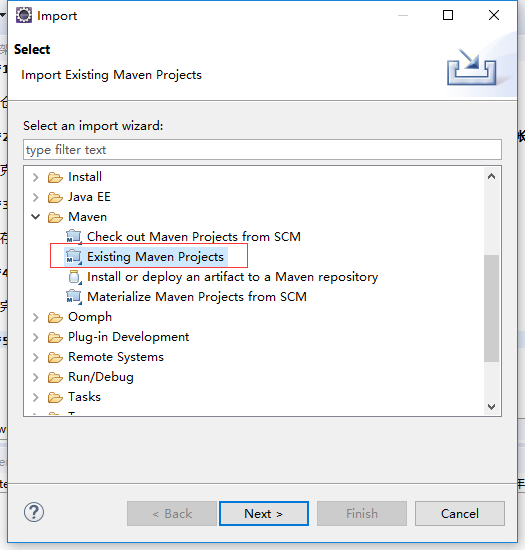
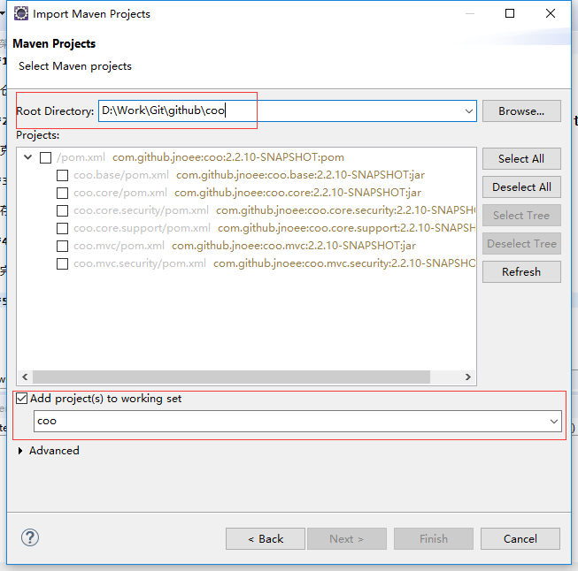
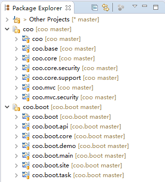
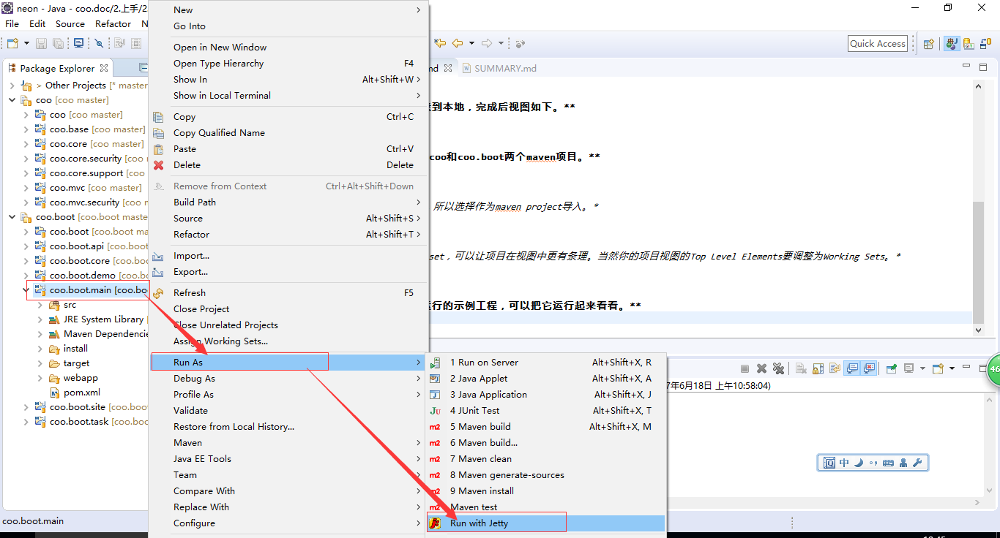
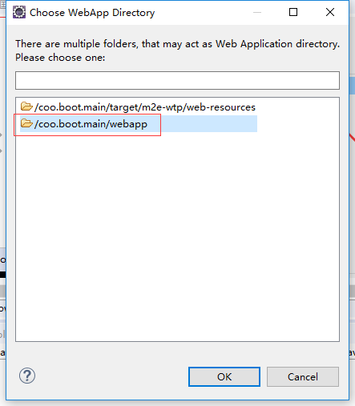
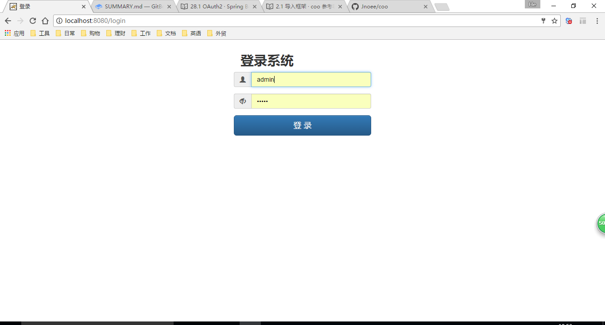

##2.1 导入框架

首先我们要把coo和coo.boot从github上克隆到本地，并导入Eclipse开发环境中。

它们在github上的地址分别是：
* https://github.com/Jnoee/coo.git
* https://github.com/Jnoee/coo.boot.git

**1.打开Eclipse的git仓库视图，并选择clone git仓库。**

**2.填写coo的git地址，只需填写URI，其它默认自动填充。如果你有github的帐号密码可以填写，也可以不填写，不影响克隆项目。**

**3.选择本地存储项目的位置。**

**4.同样的将coo.boot也克隆到本地，完成后视图如下。**

**5.从本地存储路径分别导入coo和coo.boot两个maven项目。**

*coo和coo.boot都是maven工程，所以选择作为maven project导入。*

*勾选Add project to working set，可以让项目在视图中更有条理。当然你的项目视图的Top Level Elements要调整为Working Sets。*

**6.coo.boot本身是个可以运行的示例工程，可以把它运行起来看看。**

*在coo.boot.main项目上点击右键，选择用Jetty插件运行它。*

*选择webapp目录所在的位置。*

*运行成功后的Console控制台输出日志。*

*用浏览器打开 http://localhost:8080 ，就会出现登录页面了，用户名和密码默认都是admin。*

*登录成功后，进入系统，试试已有的功能吧。*

