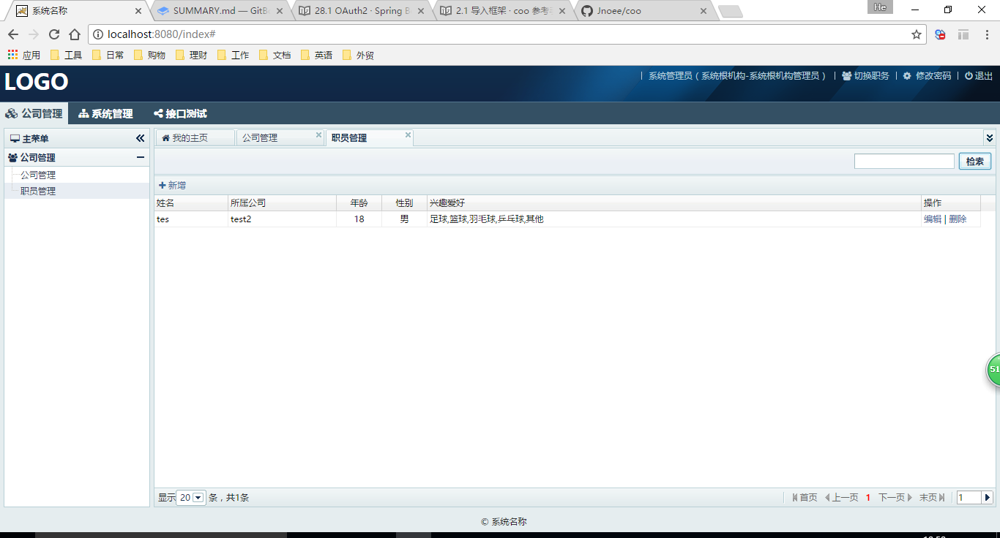

##2.2 运行示例

上一节我们已经导入了coo和coo.boot，coo.boot本身是个可以运行的示例工程，可以把它运行起来看看。

**在coo.boot.main项目上点击右键，选择用Jetty插件运行它。**

**选择webapp目录所在的位置。**

**运行成功后的Console控制台输出日志。**

**用浏览器打开 http://localhost:8080 ，就会出现登录页面了，用户名和密码默认都是admin。**

**登录成功后，进入系统，试试已有的功能吧。**

