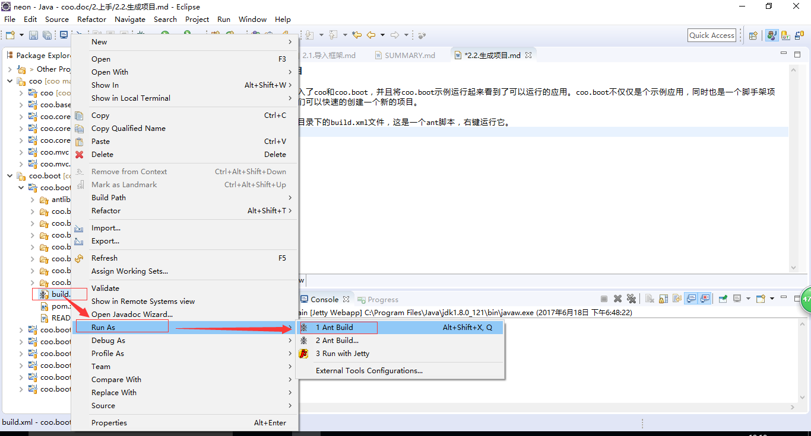
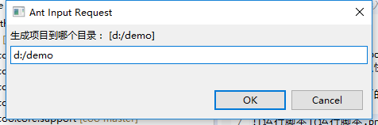
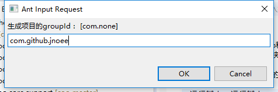

##2.3 生成项目

上一节我们已经导入了coo和coo.boot，并且将coo.boot示例运行起来看到了可以运行的应用。coo.boot不仅仅是个示例应用，同时也是一个脚手架项目，通过脚手架我们可以快速的创建一个新的项目。

**首先找到coo.boot目录下的build.xml文件，这是一个ant脚本，右键运行它。**

**根据提示填写项目生成路径、groupId、articleId。**

等看到控制台ant运行完毕后，去指定的目录查看是不是已经生成了一个maven项目。