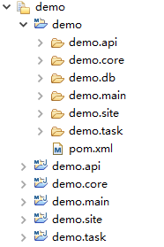
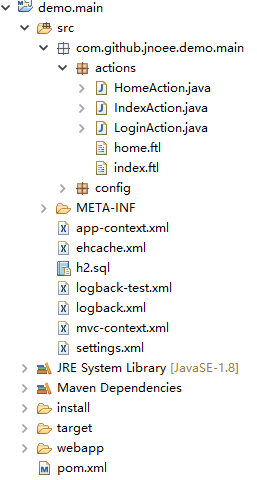

##3.1 项目结构

现在我们来看看我们的demo项目的结构，如下图：

demo是一个maven主工程，包含以下几个子模块：

    demo.core：核心模块，包含应用中不可或缺的核心业务。
    demo.site：站点模块，包含表现层的主要代码。
    demo.main：主模块，整个应用的入口模块，war模块。
    demo.task：定时任务模块，当应用中有定时任务时可将任务及调度写到这里。
    demo.api ：API接口模块，当应用中有对外的API接口时可将接口写到这里。
    demo.db  : 这个不是子模块，是放置数据库设计文件的目录。
    
coo是支持模块化开发的，每个模块可以有自己独立的配置，以demo.api为例，主要的配置有这些：

	FreeMarkerSettings.java：该模块的FreeMarker设置，例如模版路径、枚举类路径等。
	LocalSessionSettings.java：该模块的SessionFactory设置，例如实体类路径等。
	demo.api.message.xml：该模块的提示信息配置，例如页面提示、日志记录内容等。
	demo.api.permissions.xml：该模块的权限配置。
	demo.api.xml：该模块的spring配置。
	
再来看看我们的主项目demo.main的结构，如下图：

这个主项目的配置文件都在src目录下：
	
	app-context.xml：spring的主配置文件。
	mvc-context.xml：spring的servlet配置文件。
	settings.xml：应用的配置文件，整个应用可以调整的配置项都会集中在这里。
	ehcache.xml：ehcache缓存配置文件。
	logback.xml、logback-test.xml：logback的日志配置文件。
	h2.sql：应用自动创建表的sql文件。

另外我们可以看到actions目录下有index.ftl和home.ftl，其中index.ftl是应用的主页面，home.ftl是主页面中的“我的主页”。如果你想直观的改点什么看看效果，可以从这里入手。