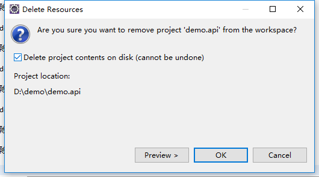

##3.2 移除模块

上一节我们介绍了整个项目的结构，可以看到demo.core、demo.site、demo.main 构成了整个web应用的主体，而demo.task、demo.api是可以剥离的子模块。这一节我们就先移除掉我们不想要的子模块，先从demo.api开始。

1.从demo.main的pom.xml文件中移除demo.api模块依赖。

2.从demo.main的app-context.xml文件中移除demo.api配置引用。

3.从demo.mian的index.ftl文件中移除接口测试菜单。

4.从demo的pom.xml文件中移除demo.api子模块。

5.删除demo.api项目，物理消灭它。

至此我们已彻底消灭了demo.api模块，同样我们把demo.task模块也干掉，只留下最精简的一个项目结构，变成这样了：

