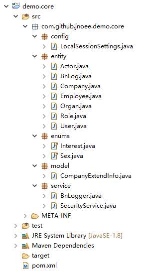

##3.3 编写实体

通过上一节移除了两个模块，我们现在得到了一个精简的项目结构。在这个基础上开始往应用里增加一个模块，我们不以子模块的形式来增加模块，而是在现有的结构上增加一个模块。

为了方便，我们就拿coo.boot.demo中实现了的公司管理模块来讲解。首先从实体着手，这跟我们在实际开发应用模块的顺序是一致的。

	1.从entity目录把Company和Employee两个实体复制到demo.core的entity包下。出现编译错误，因为缺少引用到枚举类和复合模型类。
	2.新建coo.github.jnoee.demo.core.enums包，并复制Interest、Sex两个枚举类到该包下。
	3.新建coo.github.jnoee.demo.core.model包，并复制CompanyExtendInfo到该包下。
	4.打开Company和Employee两个java文件，快捷键ctrl+shift+o重新整理引用关系，消除编译错误。

完成以后demo.core看上去是这样的：

