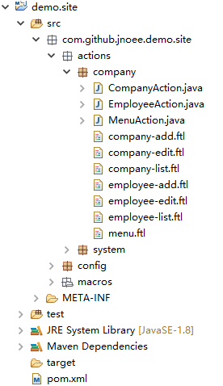

##3.5 编写action

service部分完成以后，开始复制action：

	1.在demo.site的actions包下增加一个子包company。
	2.从coo.boot.demo的actions.company包下复制所有文件到demo.site的actions.company包下。
	3.编辑CompanyAction和EmployeeAction文件，消除编译错误。
	
完成以后demo.site看上去是这样的：

