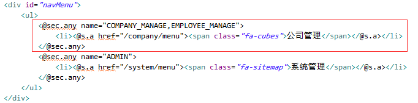
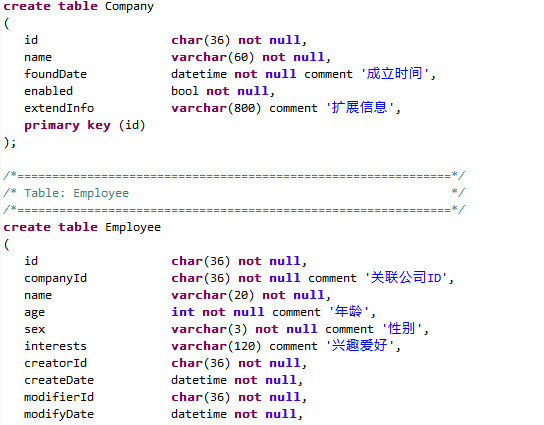
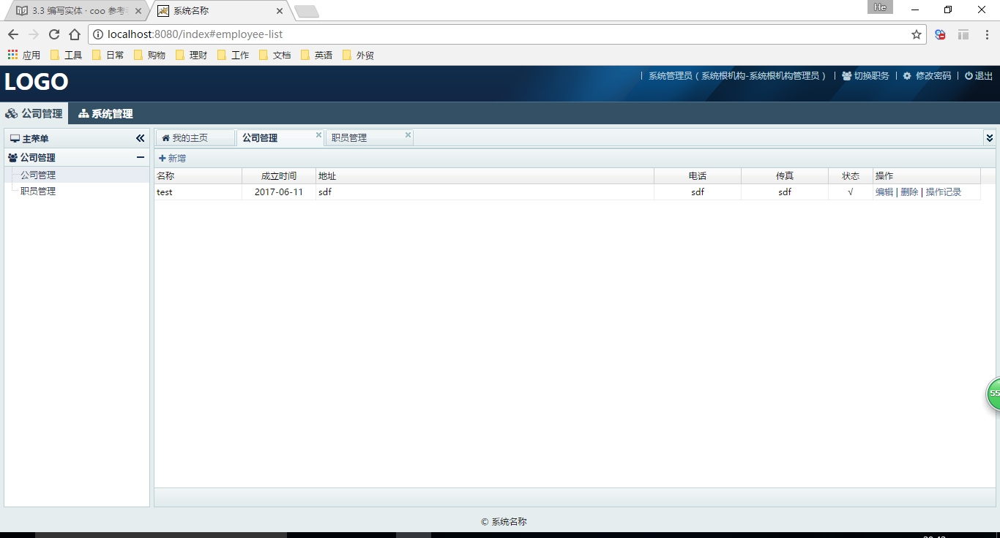

##3.6 编写页面

在上一步中我们已经将需要的页面也一起复制过来了，所以这里不用再做什么了。

打开demo.main下的index.ftl文件，看看菜单配置：

打开demo.main下的h2.sql，里面有对应的建表SQL语句：

以上这些都是脚手架生成项目时遗留下来的，如果我们是重新创建一个新的模块，这两个地方也都是需要修改的。

现在让我们再把demo.main跑起来看看：

多了一个“公司管理”菜单，然后试试里面的功能吧，跟coo.boot里一样一样的。